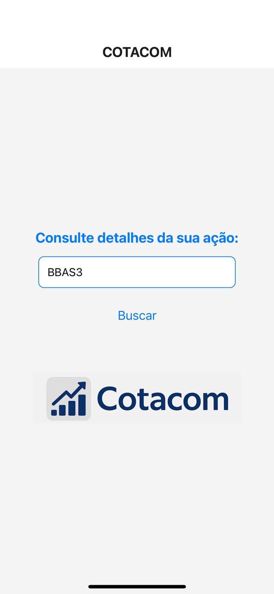
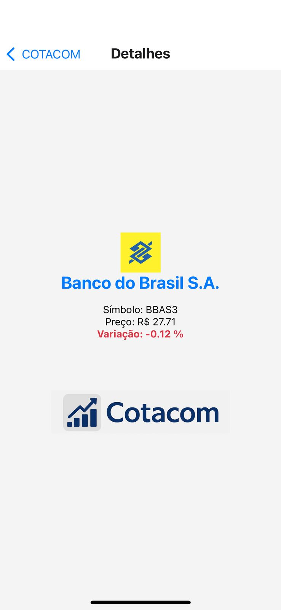

# 📈 Cotacom App


Cotacom é um aplicativo mobile desenvolvido em **React Native** que permite consultar a cotação e variação de ações da bolsa brasileira (B3). Basta inserir o código de uma ação, como `PETR4` ou `BBAS3`, para visualizar as informações em tempo real.

---

## 🖼️ Capturas de Tela

### Página Inicial


### Página de Detalhes


---

## 🗂️ Estrutura do Projeto

```bash
cotacom-app/
├── App.js                     # Arquivo principal, define as rotas da aplicação
├── assets/
│   └── img/
│       ├── logo_cotacom.png  # Logo exibido na tela
│       ├── Home.jpg          # Imagem da tela inicial (para o README)
│       └── Detalhes.jpg      # Imagem da tela de detalhes (para o README)
├── package.json              # Dependências do projeto
└── src/
    └── pages/
        ├── Home.js           # Tela inicial com input para digitar o código da ação
        └── Details.js        # Tela que exibe os detalhes da ação
```

---

## 🚀 Como Executar

### 1. Clone o repositório

```bash
git clone https://github.com/joaoespeleta/cotacom-app.git
cd cotacom-app
```

### 2. Instale as dependências

```bash
npm install
```

### 3. Execute o projeto

Com o [Expo](https://expo.dev/) instalado:

```bash
npx expo start
```

Escaneie o QR Code com o app Expo Go para rodar no celular.

---

## 🔧 Tecnologias Utilizadas

- [React Native](https://reactnative.dev/)
- [Expo](https://expo.dev/)
- [React Navigation](https://reactnavigation.org/)
- [BRAPI - Brazilian Stock API](https://brapi.dev/)

---

## 🧠 Funcionalidades

- Consulta de ações da B3 com token gratuito via API BRAPI.
- Exibição de preço, variação e logotipo da empresa.
- Suporte a imagens SVG e PNG.
- Navegação entre telas usando React Navigation.

---

## 📄 Licença

MIT © [joaoespeleta](https://github.com/joaoespeleta)
